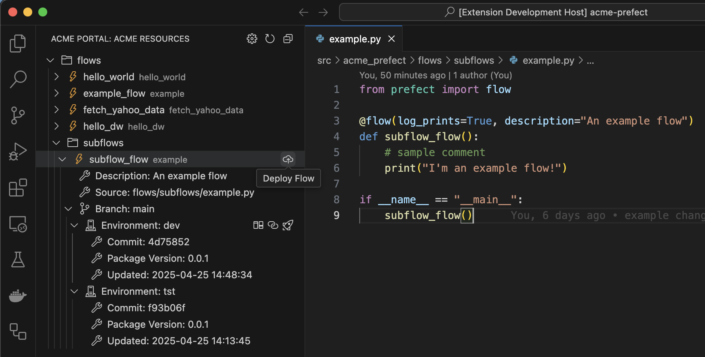

# acme-portal

> **Important:** This extension is currently in alpha and primarily for demonstration purposes. APIs may still change frequently.

`VSCode` extension for managing deployments using [`acme-portal-sdk`](https://github.com/blackwhitehere/acme-portal-sdk). Sample project using it is available at [`acme-prefect`](https://github.com/blackwhitehere/acme-prefect).

For explanation of main concepts used by the extension view `acme-portal-sdk` [docs](https://blackwhitehere.github.io/acme-portal-sdk/)

## Features

* Show and navigate all `Flows` in a project
* View existing `Flow` deployments across different `Environments` (and `branches`)
* Navigate to deployment URL from deployment tree view
* `Deploy` a flow to a given starting environment, e.g. `dev`
* `Promote` a deployment from a given environment to another environment
* View source code differences between environments

## Video Demonstration

Watch how to:

* [Navigate Flows and View Deployments](https://vimeo.com/1078680347/53b0f567f0 "Navigate Flows and View Deployments")
* [Deploy Flow Demonstration](https://vimeo.com/1078680347/53b0f567f0 "Deploy Flow Demonstration")
* [View Deployment](https://vimeo.com/1078680347/53b0f567f0 "View Deployment")
* [Promote Deployment](https://vimeo.com/1078680347/53b0f567f0 "Promote Deployment")
* [Compare Flow Deployment Versions](https://vimeo.com/1078680347/53b0f567f0 "Compare Flow Deployment Versions")

## Requirements

* Microsoft Python VSCode Extension needs to be installed
* Python environment used by your project needs to be selected with `Python: Select Interpreter` command
* Project needs to add as dependency & setup [`acme-portal-sdk`](https://blackwhitehere.github.io/acme-portal-sdk)
* `git` CLI needs to be installed
* Opened project needs to have remote source pointing to a `GitHub` repository (Other repos to be supported)

## Dev setup

* Go `VSCode` `Run and Debug` tab and run `Run Extension` configuration.
* Open [`acme-prefect`](https://github.com/blackwhitehere/acme-prefect) repository which you have pulled locally.
* Create python virtual env according to instructions in the repo and set it using `Python: Select Interpreter`

## Build and publish

Follow [link](https://code.visualstudio.com/api/working-with-extensions/publishing-extension)

## Extension Settings

## Release Notes

### 0.0.1

Initial release of `acme-portal`

---

## Following extension guidelines

Ensure that you've read through the extensions guidelines and follow the best practices for creating your extension.

* [Extension Guidelines](https://code.visualstudio.com/api/references/extension-guidelines)